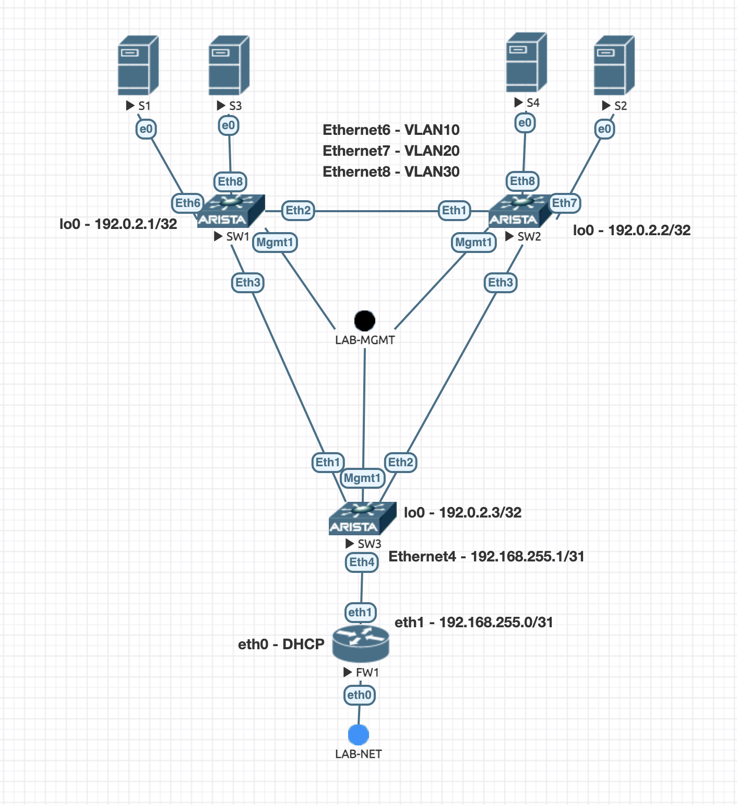

# EVPN/VXLAN L2VPN



```
SW3(config)#show vxlan control-plane
   VLAN       Control Plane       Direction    Source
---------- ------------------- --------------- -------------
   10         EVPN                both         configuration
   20         EVPN                both         configuration
   30         EVPN                both         configuration
```

```
SW3(config)#show vxlan address-table
          Vxlan Mac Address Table
----------------------------------------------------------------------

VLAN  Mac Address     Type      Prt  VTEP             Moves   Last Move
----  -----------     ----      ---  ----             -----   ---------
  10  5000.0004.0000  EVPN      Vx1  192.0.2.1        1       0:10:15 ago
  30  5000.0006.0000  EVPN      Vx1  192.0.2.1        1       0:10:24 ago
  30  5000.0008.0000  EVPN      Vx1  192.0.2.2        1       0:05:59 ago
Total Remote Mac Addresses for this criterion: 3

SW3(config)#show mac address-table
          Mac Address Table
------------------------------------------------------------------

Vlan    Mac Address       Type        Ports      Moves   Last Move
----    -----------       ----        -----      -----   ---------
   1    aabb.ccdd.0003    STATIC      Cpu
  10    5000.0004.0000    DYNAMIC     Vx1        1       0:10:35 ago
  10    aabb.ccdd.0003    STATIC      Cpu
  20    aabb.ccdd.0003    STATIC      Cpu
  30    5000.0006.0000    DYNAMIC     Vx1        1       0:10:44 ago
  30    5000.0008.0000    DYNAMIC     Vx1        1       0:06:19 ago
  30    aabb.ccdd.0003    STATIC      Cpu
Total Mac Addresses for this criterion: 7
```

```
SW3(config)#show bgp evpn
BGP routing table information for VRF default
Router identifier 192.0.2.3, local AS number 199344
Route status codes: * - valid, > - active, S - Stale, E - ECMP head, e - ECMP
                    c - Contributing to ECMP, % - Pending BGP convergence
Origin codes: i - IGP, e - EGP, ? - incomplete
AS Path Attributes: Or-ID - Originator ID, C-LST - Cluster List, LL Nexthop - Link Local Nexthop

          Network                Next Hop              Metric  LocPref Weight  Path
 * >      RD: 192.0.2.1:10 mac-ip 5000.0004.0000
                                 192.0.2.1             -       100     0       i
 * >      RD: 192.0.2.1:10 mac-ip 5000.0004.0000 172.16.10.10
                                 192.0.2.1             -       100     0       i
 * >      RD: 192.0.2.1:30 mac-ip 5000.0006.0000
                                 192.0.2.1             -       100     0       i
 * >      RD: 192.0.2.1:30 mac-ip 5000.0006.0000 172.16.30.10
                                 192.0.2.1             -       100     0       i
 * >      RD: 192.0.2.2:30 mac-ip 5000.0008.0000
                                 192.0.2.2             -       100     0       i
 * >      RD: 192.0.2.2:30 mac-ip 5000.0008.0000 172.16.30.12
                                 192.0.2.2             -       100     0       i
 * >      RD: 192.0.2.1:10 imet 192.0.2.1
                                 192.0.2.1             -       100     0       i
 * >      RD: 192.0.2.1:20 imet 192.0.2.1
                                 192.0.2.1             -       100     0       i
 * >      RD: 192.0.2.1:30 imet 192.0.2.1
                                 192.0.2.1             -       100     0       i
 * >      RD: 192.0.2.2:10 imet 192.0.2.2
                                 192.0.2.2             -       100     0       i
 * >      RD: 192.0.2.2:20 imet 192.0.2.2
                                 192.0.2.2             -       100     0       i
 * >      RD: 192.0.2.2:30 imet 192.0.2.2
                                 192.0.2.2             -       100     0       i
 * >      RD: 192.0.2.3:10 imet 192.0.2.3
                                 -                     -       -       0       i
 * >      RD: 192.0.2.3:20 imet 192.0.2.3
                                 -                     -       -       0       i
 * >      RD: 192.0.2.3:30 imet 192.0.2.3
                                 -                     -       -       0       i
```

```
SW3(config)#show bgp summary
BGP summary information for VRF default
Router identifier 192.0.2.3, local AS number 199344
Neighbor           AS Session State AFI/SAFI                AFI/SAFI State   NLRI Rcd   NLRI Acc
--------- ----------- ------------- ----------------------- -------------- ---------- ----------
192.0.2.1      199344 Established   IPv4 Unicast            Negotiated              0          0
192.0.2.1      199344 Established   L2VPN EVPN              Negotiated              7          7
192.0.2.2      199344 Established   IPv4 Unicast            Negotiated              0          0
192.0.2.2      199344 Established   L2VPN EVPN              Negotiated              5          5
```

```
debian@S4:~$ traceroute 1.1.1.1
traceroute to 1.1.1.1 (1.1.1.1), 30 hops max, 60 byte packets
 1  * * *
 2  192.0.2.3 (192.0.2.3)  7.427 ms  8.371 ms  9.646 ms
 3  192.168.255.0 (192.168.255.0)  10.810 ms  11.763 ms  12.772 ms
 4  eth4-5.fw1.yzguy.net (192.168.225.1)  13.653 ms  14.568 ms  15.504 ms
 5  96.120.8.125 (96.120.8.125)  19.996 ms  28.332 ms  29.118 ms
 6  po-303-1221-rur101.lebanon.pa.pitt.comcast.net (96.110.219.77)  24.943 ms  18.776
 ms  18.405 ms
 7  po-2-rur102.lebanon.pa.pitt.comcast.net (96.110.26.158)  21.663 ms  21.067 ms  22
.207 ms
 8  po-100-xar02.lebanon.pa.pitt.comcast.net (162.151.48.69)  19.691 ms  21.132 ms  2
1.224 ms
 9  be-21-rar01.lancaster.pa.pitt.comcast.net (162.151.220.81)  21.196 ms  17.510 ms 
 16.320 ms
10  be-34-ar01.mckeesport.pa.pitt.comcast.net (69.139.168.141)  24.056 ms  24.052 ms 
 29.029 ms
11  76.96.117.78 (76.96.117.78)  27.192 ms  24.854 ms  23.634 ms
12  one.one.one.one (1.1.1.1)  30.457 ms  29.959 ms  28.669 ms

debian@S4:~$ traceroute 172.16.10.10
traceroute to 172.16.10.10 (172.16.10.10), 30 hops max, 60 byte packets
 1  * * *
 2  172.16.10.10 (172.16.10.10)  8.759 ms  9.442 ms  10.539 ms

debian@S4:~$ traceroute 172.16.30.13
traceroute to 172.16.30.13 (172.16.30.13), 30 hops max, 60 byte packets
 1  linux (172.16.30.13)  10.578 ms  11.352 ms  11.877 ms
```
