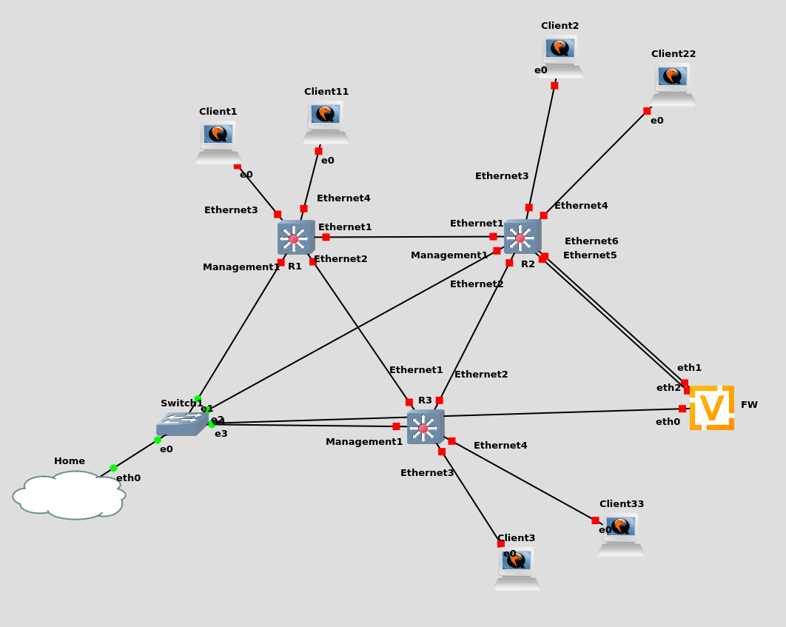

# EVPN-VXLAN

[Reference](https://overlaid.net/2019/01/27/arista-bgp-evpn-configuration-example/)

3 L3 switches meshed, peering with an underlay and overlay, as well as EVPN.

L2VXLAN for VLAN100

- Client1
- Client2
- Client3
- FW (eth1)

L3VXLAN for VLAN1000,1001,1002

- Client11
- Client22
- Client33
- FW (eth2)



Credentials:

* Arista: `admin/admin`
* VyOS: `vyos/admin`
* Ubuntu: `ubuntu/ubuntu`


## Network

* Underlay: 192.168.11.0/24 (/31s per link)
* Overlay: 192.168.10.0/24 (/32 per device)
* VTEPs: 192.168.9.0/24 (/32 per VTEP)

## EVPN-VXLAN

```
R1#show vxlan vtep
Remote VTEPS for Vxlan1:
192.168.9.2
192.168.9.3
Total number of remote VTEPS: 2
```

### Show MAC addresses learned over VXLAN

```
R1#show vxlan address-table 
          Vxlan Mac Address Table
----------------------------------------------------------------------

VLAN  Mac Address     Type     Prt  VTEP             Moves   Last Move
----  -----------     ----     ---  ----             -----   ---------
 100  0c40.e7d2.0000  EVPN     Vx1  192.168.9.3      1       0:12:17 ago
 100  0cc9.4b2f.0001  EVPN     Vx1  192.168.9.2      1       0:12:17 ago
 100  0cdc.a167.0000  EVPN     Vx1  192.168.9.2      1       0:12:17 ago
4094  0c3c.5864.b102  EVPN     Vx1  192.168.9.2      1       0:12:35 ago
4094  0c55.7ddc.2858  EVPN     Vx1  192.168.9.3      1       0:12:37 ago
```

### Show MAC addresss routes over EVPN

```
R1#show bgp evpn route-type mac-ip 
BGP routing table information for VRF default
Router identifier 192.168.10.1, local AS number 65001
Route status codes: s - suppressed, * - valid, > - active, E - ECMP head, e - ECMP
                    S - Stale, c - Contributing to ECMP, b - backup
                    % - Pending BGP convergence
Origin codes: i - IGP, e - EGP, ? - incomplete
AS Path Attributes: Or-ID - Originator ID, C-LST - Cluster List, LL Nexthop - Link Local Nexthop

          Network                Next Hop              Metric  LocPref Weight  Path
 * >     RD: 192.168.10.1:100 mac-ip 0c08.287a.0000
                                 -                     -       -       0       i
 * >     RD: 192.168.10.3:100 mac-ip 0c40.e7d2.0000
                                 192.168.9.3           -       100     0       65003 i
 *       RD: 192.168.10.3:100 mac-ip 0c40.e7d2.0000
                                 192.168.9.3           -       100     0       65002 65003 i
 * >     RD: 192.168.10.2:100 mac-ip 0cc9.4b2f.0001
                                 192.168.9.2           -       100     0       65002 i
 *       RD: 192.168.10.2:100 mac-ip 0cc9.4b2f.0001
                                 192.168.9.2           -       100     0       65003 65002 i
 * >     RD: 192.168.10.2:100 mac-ip 0cdc.a167.0000
                                 192.168.9.2           -       100     0       65002 i
 *       RD: 192.168.10.2:100 mac-ip 0cdc.a167.0000
                                 192.168.9.2           -       100     0       65003 65002 i
```

### Show prefixes routes over EVPN

```
R1# show bgp evpn route-type ip-prefix ipv4
BGP routing table information for VRF default
Router identifier 192.168.10.1, local AS number 65001
Route status codes: s - suppressed, * - valid, > - active, E - ECMP head, e - ECMP
                    S - Stale, c - Contributing to ECMP, b - backup
                    % - Pending BGP convergence
Origin codes: i - IGP, e - EGP, ? - incomplete
AS Path Attributes: Or-ID - Originator ID, C-LST - Cluster List, LL Nexthop - Link Local Nexthop

          Network                Next Hop              Metric  LocPref Weight  Path
 * >     RD: 192.168.10.2:1 ip-prefix 0.0.0.0/0
                                 192.168.9.2           -       100     0       65002 65000 i
 *       RD: 192.168.10.2:1 ip-prefix 0.0.0.0/0
                                 192.168.9.2           -       100     0       65003 65002 65000 i
 * >     RD: 192.168.10.1:1 ip-prefix 192.168.5.0/24
                                 -                     -       -       0       i
 * >     RD: 192.168.10.2:1 ip-prefix 192.168.6.0/24
                                 192.168.9.2           -       100     0       65002 i
 *       RD: 192.168.10.2:1 ip-prefix 192.168.6.0/24
                                 192.168.9.2           -       100     0       65003 65002 i
 * >     RD: 192.168.10.3:1 ip-prefix 192.168.7.0/24
                                 192.168.9.3           -       100     0       65003 i
 *       RD: 192.168.10.3:1 ip-prefix 192.168.7.0/24
                                 192.168.9.3           -       100     0       65002 65003 i
 * >     RD: 192.168.10.2:1 ip-prefix 192.168.99.0/31
                                 192.168.9.2           -       100     0       65002 i
 *       RD: 192.168.10.2:1 ip-prefix 192.168.99.0/31
                                 192.168.9.2           -       100     0       65003 65002 i
```

#### Show routes via VTEP nexthops

```
R1#show ip route vrf YZGUY

VRF: YZGUY
Codes: C - connected, S - static, K - kernel, 
       O - OSPF, IA - OSPF inter area, E1 - OSPF external type 1,
       E2 - OSPF external type 2, N1 - OSPF NSSA external type 1,
       N2 - OSPF NSSA external type2, B - BGP, B I - iBGP, B E - eBGP,
       R - RIP, I L1 - IS-IS level 1, I L2 - IS-IS level 2,
       O3 - OSPFv3, A B - BGP Aggregate, A O - OSPF Summary,
       NG - Nexthop Group Static Route, V - VXLAN Control Service,
       DH - DHCP client installed default route, M - Martian,
       DP - Dynamic Policy Route, L - VRF Leaked,
       RC - Route Cache Route

Gateway of last resort:
 B E      0.0.0.0/0 [200/0] via VTEP 192.168.9.2 VNI 1000 router-mac 0c:3c:58:64:b1:02

 C        192.168.5.0/24 is directly connected, Vlan1000
 B E      192.168.6.0/24 [200/0] via VTEP 192.168.9.2 VNI 1000 router-mac 0c:3c:58:64:b1:02
 B E      192.168.7.0/24 [200/0] via VTEP 192.168.9.3 VNI 1000 router-mac 0c:55:7d:dc:28:58
 B E      192.168.99.0/31 [200/0] via VTEP 192.168.9.2 VNI 1000 router-mac 0c:3c:58:64:b1:02
 ```

## Output

### Traceroute from Client1 to Client11

Client1 -> FW (eth1) -> R2 -> R1 -> Client11

```
ubuntu@client1:~$ traceroute 192.168.5.100 -n
traceroute to 192.168.5.100 (192.168.5.100), 30 hops max, 60 byte packets
 1  192.168.100.1  17.902 ms  19.649 ms  22.313 ms
 2  192.168.99.1  33.558 ms  36.532 ms  41.988 ms
 3  192.168.5.1  68.837 ms  70.097 ms  79.184 ms
 4  192.168.5.100  81.902 ms  83.282 ms  88.136 ms
```

### Traceroute from Client1 to 1.1.1.1

```
ubuntu@client1:~$ traceroute 1.1.1.1 
traceroute to 1.1.1.1 (1.1.1.1), 30 hops max, 60 byte packets
 1  _gateway (192.168.100.1)  14.903 ms  16.507 ms  18.291 ms
 2  vlan1.router.yzguy.net (192.168.221.1)  20.197 ms  30.576 ms  31.721 ms
 3  ge-0-0-2.firewall.yzguy.net (192.168.220.1)  26.079 ms  27.243 ms  34.490 ms
 4  96.120.107.73 (96.120.107.73)  41.327 ms  42.506 ms  45.365 ms
 5  24.124.178.41 (24.124.178.41)  46.617 ms  48.848 ms  50.180 ms
 6  68.87.128.253 (68.87.128.253)  51.419 ms  20.297 ms  34.044 ms
 7  be-501-arsc1.capitolhghts.md.bad.comcast.net (96.110.235.17)  23.791 ms  25s
 8  be-31441-cs04.beaumeade.va.ibone.comcast.net (96.110.40.29)  31.793 ms be-3s
 9  be-3204-pe04.ashburn.va.ibone.comcast.net (96.110.37.134)  39.353 ms be-310s
10  * * *
11  172.71.192.2 (172.71.192.2)  44.422 ms 172.70.36.3 (172.70.36.3)  72.023 mss
12  one.one.one.one (1.1.1.1)  22.246 ms  23.303 ms  26.140 ms
```

### Traceroute from Client11 to Client33

```
ubuntu@client11:~$ traceroute 192.168.7.100
traceroute to 192.168.7.100 (192.168.7.100), 30 hops max, 60 byte packets
 1  _gateway (192.168.5.1)  6.458 ms  7.216 ms  10.682 ms
 2  192.168.7.1 (192.168.7.1)  27.015 ms  27.792 ms  33.464 ms
 3  192.168.7.100 (192.168.7.100)  34.233 ms  40.492 ms  41.302 ms
```

### Traceroute from Client11 to 1.1.1.1

```
ubuntu@client11:~$ traceroute 1.1.1.1
traceroute to 1.1.1.1 (1.1.1.1), 30 hops max, 60 byte packets
 1  _gateway (192.168.5.1)  5.746 ms  7.396 ms  10.059 ms
 2  192.168.99.1 (192.168.99.1)  25.135 ms  25.948 ms  32.993 ms
 3  192.168.99.0 (192.168.99.0)  33.735 ms  39.919 ms  41.065 ms
 4  vlan1.router.yzguy.net (192.168.221.1)  43.914 ms  47.617 ms  48.465 ms
 5  ge-0-0-2.firewall.yzguy.net (192.168.220.1)  44.824 ms  50.965 ms  51.744 ms
 6  96.120.107.73 (96.120.107.73)  56.898 ms  22.273 ms  27.883 ms
 7  24.124.178.41 (24.124.178.41)  26.756 ms  33.332 ms  34.130 ms
 8  68.87.128.253 (68.87.128.253)  39.969 ms  40.884 ms  43.601 ms
 9  be-501-arsc1.capitolhghts.md.bad.comcast.net (96.110.235.17)  44.320 ms  47s
10  be-31421-cs02.beaumeade.va.ibone.comcast.net (96.110.40.21)  50.984 ms  51.s
11  be-3204-pe04.ashburn.va.ibone.comcast.net (96.110.37.134)  55.086 ms be-310s
12  * as2906-c-3.sanjose.ibone.comcast.net (173.167.57.102)  27.222 ms *
13  172.71.188.2 (172.71.188.2)  36.633 ms 172.70.40.3 (172.70.40.3)  32.574 mss
14  one.one.one.one (1.1.1.1)  35.972 ms  31.714 ms  43.669 ms
```
