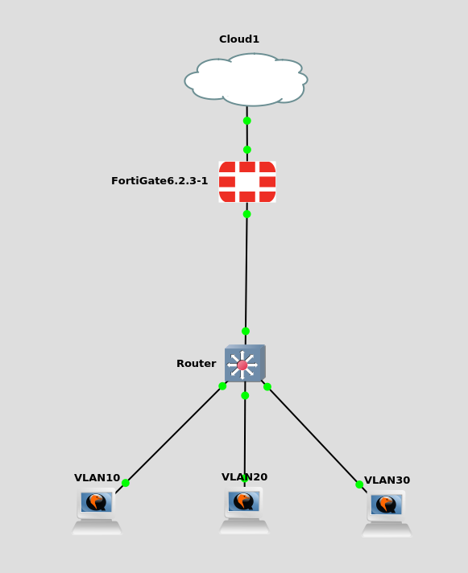

# VRF Firewalling

Terminating gateways on a L3 switch, but still having stateful firewalling.

Create VRF per Zone, place VLANs within respective VRF. Intra-zone traffic is allow and never goes up to the firewall. Inter-zone traffic flows through firewall.

Routing protocol runs within each VRF and advertises it's routes to the firewall. This makes it so routes to another VRF has a next-hop of the firewall.

Firewall "could" have VRFs to match and would need to leak routes across VRFs. However routed subinterface on the uplink also works, and the firewall places each subinterface in the appropriate firewall zone

