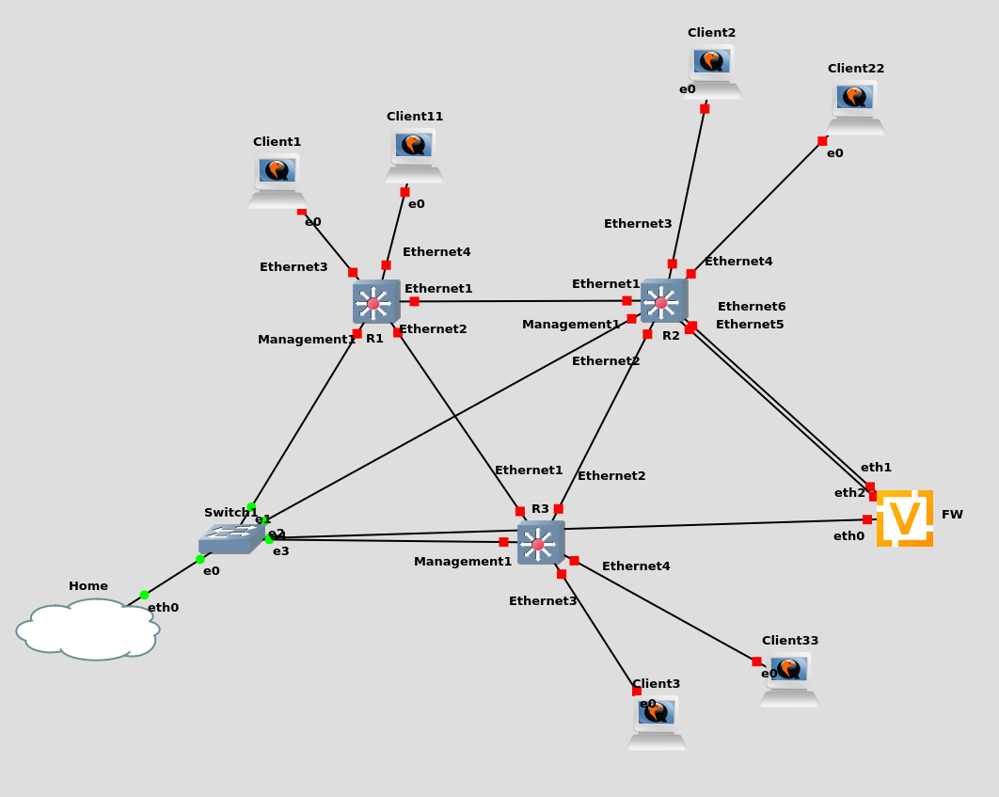

# EVPN-VXLAN

[Reference](https://overlaid.net/2019/01/27/arista-bgp-evpn-configuration-example/)

3 L3 switches meshed, peering with an underlay and overlay, as well as EVPN.

L2VXLAN for VLAN100

- Client1
- Client2
- Client3
- FW (eth1)

L3VXLAN for VLAN1000,1001,1002

- Client11
- Client22
- Client33
- FW (eth2)

Credentials:

* Arista: `admin/admin`
* VyOS: `vyos/admin`
* Ubuntu: `ubuntu/ubuntu`
