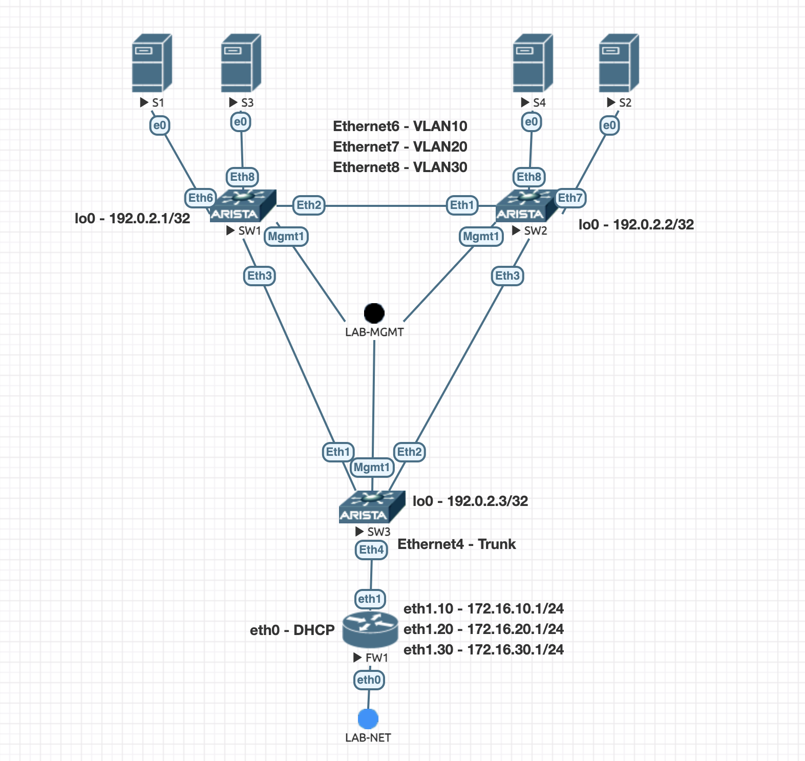

# VXLAN

Simple VXLAN topology using OSPF unnumbered as IGP and VXLAN VTEP flooding



```
Last login: Sat Nov 18 18:48:21 2023 from 192.168.221.113
SW3#show interfaces vxlan 1
Vxlan1 is up, line protocol is up (connected)
  Hardware is Vxlan
  Source interface is Loopback0 and is active with 192.0.2.3
  Listening on UDP port 4789
  Replication/Flood Mode is headend with Flood List Source: CLI
  Remote MAC learning via Datapath
  VNI mapping to VLANs
  Static VLAN to VNI mapping is
    [10, 10]          [20, 20]          [30, 30]
  Note: All Dynamic VLANs used by VCS are internal VLANs.
        Use 'show vxlan vni' for details.
  Static VRF to VNI mapping is not configured
  Headend replication flood vtep list is:
    10 192.0.2.2       192.0.2.1
    20 192.0.2.2       192.0.2.1
    30 192.0.2.2       192.0.2.1
  Shared Router MAC is 0000.0000.0000
```

```
SW3#show vxlan address-table
          Vxlan Mac Address Table
----------------------------------------------------------------------

VLAN  Mac Address     Type      Prt  VTEP             Moves   Last Move
----  -----------     ----      ---  ----             -----   ---------
  10  5000.0004.0000  DYNAMIC   Vx1  192.0.2.1        50867   13:19:39 ago
  20  5000.0005.0000  DYNAMIC   Vx1  192.0.2.2        65195   13:18:37 ago
  30  5000.0006.0000  DYNAMIC   Vx1  192.0.2.1        1       0:36:30 ago
  30  5000.0008.0000  DYNAMIC   Vx1  192.0.2.2        1       0:36:01 ago
Total Remote Mac Addresses for this criterion: 4
```

```
SW3#show mac address-table
          Mac Address Table
------------------------------------------------------------------

Vlan    Mac Address       Type        Ports      Moves   Last Move
----    -----------       ----        -----      -----   ---------
  10    5000.0004.0000    DYNAMIC     Vx1        50867   13:19:54 ago
  10    7805.9600.0001    DYNAMIC     Et4        1       0:32:51 ago
  20    5000.0005.0000    DYNAMIC     Vx1        65195   13:18:53 ago
  20    7805.9600.0001    DYNAMIC     Et4        1       0:12:04 ago
  30    5000.0006.0000    DYNAMIC     Vx1        1       0:36:45 ago
  30    5000.0008.0000    DYNAMIC     Vx1        1       0:36:16 ago
  30    7805.9600.0001    DYNAMIC     Et4        1       0:11:46 ago
Total Mac Addresses for this criterion: 7
```
